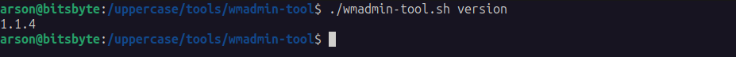
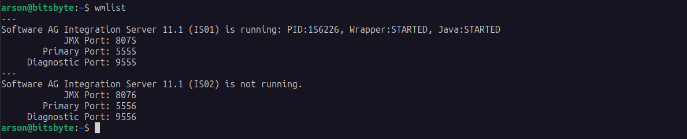
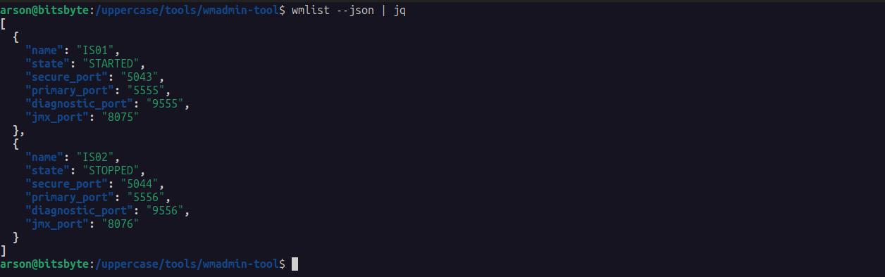

# WmAdmin Tool Guide

**WmAdmin Tool** is custom tool made for simplify WebMethod Integration Server management. Not so fancy, just for personal use.

## Installation

Clone the latest build from github, and make it executable

```
git clone https://github.com/m-arson/wmadmin-tool.git
cd wmadmin-tool/
chmod +x wmadmin-tool.sh
```

To check the `wmadmin-tool.sh` version can use command
```
./wmadmin-tool.sh version
```



```
./wmadmin-tool.sh install --dir /opt/wm
```


When creating new Integration server it will have below default value:

```
Username         : Administrator
Password         : manage
JMX Port*        : 8075
Primary Port*    : 5555
Diagnostic Port* : 9555

* Will increase the ports automatically (+1) when new Integration Server created. e.g.:
  - JMX Port is 8076
  - Primary Port is 5556
  - Diagnostic Port is 9556

```

## Uninstall
To uninstall **WmAdmin Tool** just run command:

```
./wmadmin-tool.sh uninstall --dir /opt/wm
```


## Administration

Create new Integration Server
```
wmcreate <integrationServerName>
```

Delete Integration Server
```
wmdelete <integrationServerName>
```

Start Integration Server
```
wmstart <integrationServerName>
```

Stop Integration Server
```
wmstop <integrationServerName>
```

List all Integration Server
```
wmlist
wmlist --json
```


